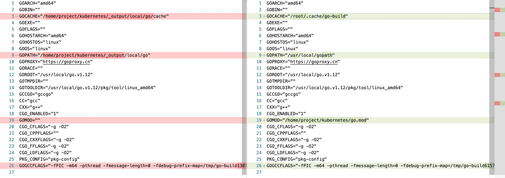

使用go1.13在kubernetes根目录下执行`make`会失败, 追踪发现是如下形式命令出现错误, `go install`安装vendor下的工程时无法找到依赖包. 但是进入到vendor下的具体工程独立安装又是可以的.

```console
$ go install -gcflags ' -trimpath=/home/project/kubernetes' -asmflags -trimpath=/home/project/kubernetes -ldflags '-s -w -X "k8s.io/kubernetes/pkg/version.buildDate=2020-01-03T09:59:49Z" -X "k8s.io/kubernetes/vendor/k8s.io/client-go/pkg/version.buildDate=2020-01-03T09:59:49Z" -X "k8s.io/kubernetes/vendor/k8s.io/kubectl/pkg/version.buildDate=2020-01-03T09:59:49Z" -X "k8s.io/kubernetes/cmd/kubeadm/app/version.buildDate=2020-01-03T09:59:49Z" -X "k8s.io/kubernetes/vendor/k8s.io/component-base/version.buildDate=2020-01-03T09:59:49Z" -X "k8s.io/kubernetes/pkg/version.gitCommit=2bd9643cee5b3b3a5ecbd3af49d09018f0773c77" -X "k8s.io/kubernetes/vendor/k8s.io/client-go/pkg/version.gitCommit=2bd9643cee5b3b3a5ecbd3af49d09018f0773c77" -X "k8s.io/kubernetes/vendor/k8s.io/kubectl/pkg/version.gitCommit=2bd9643cee5b3b3a5ecbd3af49d09018f0773c77" -X "k8s.io/kubernetes/cmd/kubeadm/app/version.gitCommit=2bd9643cee5b3b3a5ecbd3af49d09018f0773c77" -X "k8s.io/kubernetes/vendor/k8s.io/component-base/version.gitCommit=2bd9643cee5b3b3a5ecbd3af49d09018f0773c77" -X "k8s.io/kubernetes/pkg/version.gitTreeState=dirty" -X "k8s.io/kubernetes/vendor/k8s.io/client-go/pkg/version.gitTreeState=dirty" -X "k8s.io/kubernetes/vendor/k8s.io/kubectl/pkg/version.gitTreeState=dirty" -X "k8s.io/kubernetes/cmd/kubeadm/app/version.gitTreeState=dirty" -X "k8s.io/kubernetes/vendor/k8s.io/component-base/version.gitTreeState=dirty" -X "k8s.io/kubernetes/pkg/version.gitVersion=v1.16.0-dirty" -X "k8s.io/kubernetes/vendor/k8s.io/client-go/pkg/version.gitVersion=v1.16.0-dirty" -X "k8s.io/kubernetes/vendor/k8s.io/kubectl/pkg/version.gitVersion=v1.16.0-dirty" -X "k8s.io/kubernetes/cmd/kubeadm/app/version.gitVersion=v1.16.0-dirty" -X "k8s.io/kubernetes/vendor/k8s.io/component-base/version.gitVersion=v1.16.0-dirty" -X "k8s.io/kubernetes/pkg/version.gitMajor=1" -X "k8s.io/kubernetes/vendor/k8s.io/client-go/pkg/version.gitMajor=1" -X "k8s.io/kubernetes/vendor/k8s.io/kubectl/pkg/version.gitMajor=1" -X "k8s.io/kubernetes/cmd/kubeadm/app/version.gitMajor=1" -X "k8s.io/kubernetes/vendor/k8s.io/component-base/version.gitMajor=1" -X "k8s.io/kubernetes/pkg/version.gitMinor=16+" -X "k8s.io/kubernetes/vendor/k8s.io/client-go/pkg/version.gitMinor=16+" -X "k8s.io/kubernetes/vendor/k8s.io/kubectl/pkg/version.gitMinor=16+" -X "k8s.io/kubernetes/cmd/kubeadm/app/version.gitMinor=16+" -X "k8s.io/kubernetes/vendor/k8s.io/component-base/version.gitMinor=16+"' k8s.io/kubernetes/vendor/k8s.io/code-generator/cmd/deepcopy-gen
```

```
can't load package: package k8s.io/kubernetes/vendor/k8s.io/code-generator/cmd/deepcopy-gen: unknown import path "k8s.io/kubernetes/vendor/k8s.io/code-generator/cmd/deepcopy-gen": cannot find module providing package k8s.io/kubernetes/vendor/k8s.io/code-generator/cmd/deepcopy-gen
```

但我自己在使用go1.12再执行install时, 还是会出现上述错误.

```
$ go install k8s.io/kubernetes/vendor/k8s.io/code-generator/cmd/deepcopy-gen
can't load package: package k8s.io/kubernetes/vendor/k8s.io/code-generator/cmd/deepcopy-gen: unknown import path "k8s.io/kubernetes/vendor/k8s.io/code-generator/cmd/deepcopy-gen": cannot find module providing package k8s.io/kubernetes/vendor/k8s.io/code-generator/cmd/deepcopy-gen
```

在搜寻了多篇文章后, 我发现很可能是`go env`有所不同.



其中`_output/local/go`结构类似于`GOPATH`.

```
/home/project/kubernetes/_output/local/go/src/k8s.io
$ ll
总用量 0
-rw-r--r-- 1 root root  0 1月   4 15:52 DONT_FOLLOW_SYMLINKS_WHEN_TRAVERSING_THIS_DIRECTORY_VIA_A_RECURSIVE_TARGET_PATTERN
lrwxrwxrwx 1 root root 24 1月   4 15:48 kubernetes -> /home/project/kubernetes
```

不过无论我怎么尝试, 都无法改变`GOENV`的值. go在执行子命令时貌似会自动改写`GOENV`, 自动把`go.mod`所在路径写到GOENV中.

目前还不清楚kuber的编译过程中是如何操作的, 先跳过这一话题吧.
